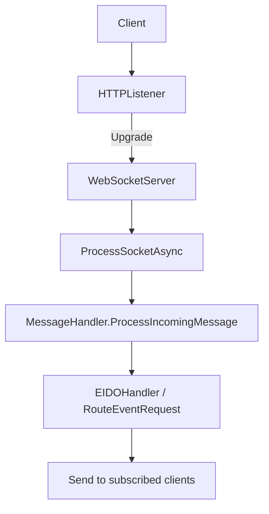
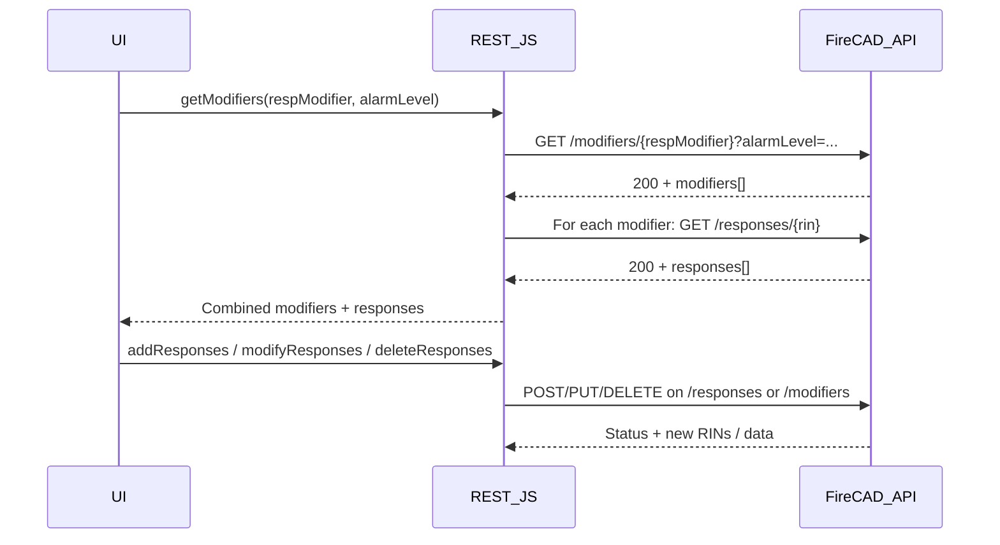
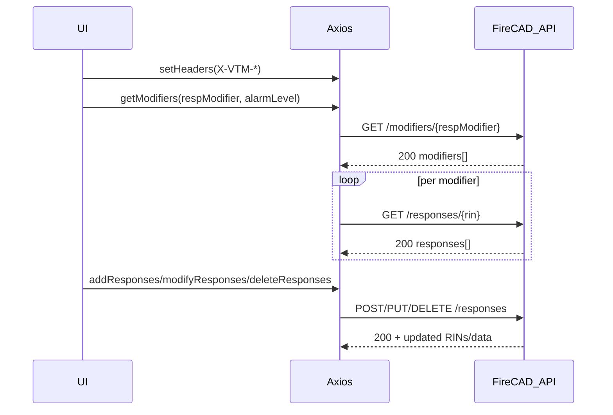

# CAD 8 Communications Guide

Purpose: Explain how CAD 8 components communicate across the stack (frontend, backend, services), with readable flow charts, essential file locations, and patterns usable for knowledge transfer and onboarding.

Audience: Developers, integrators, support staff, and QA working with CAD 8.

---

## 1) System overview

CAD 8 is a multi-component system that communicates via:
- HTTP/REST APIs (Genero 4GL backends and service endpoints)
- WebSockets (NG911 EIDO conveyance)
- Valkey (Redis-compatible) pub/sub and queues for client signaling and map updates
- Web Services (SOAP/WS style) for legacy integrations
- CEFSharp browser bridge for passing data from the C# frontend to embedded web UIs

High-level components:
- Backend service modules (Genero 4GL, Python, C)
- Frontend desktop apps (C#, WPF) and embedded browser UIs (CEFSharp)
- NG911 EIDO WebSocket server and conveyance workers (.NET)
- Valkey integration and signaling library (Genero 4GL + C)
- Specialized frontend web apps (Response Recommendation Config, React Reports)

---

## 2) Communication channels

### 2.1 REST/HTTP
- Backend exposes REST endpoints in multiple modules:
  - BSS REST API (Versioned, GET/POST handlers)
  - Fire CAD Response Recommendations (GET/POST/PUT/DELETE endpoints)
  - RapidSOS, Hospitals, etc. utility endpoints
- Frontend and web apps call these endpoints via `HttpClient` (C#) or `axios` (JS).
- Shared request headers standardize identity, transaction tracing, and context.

Flow: Frontend → REST API → Handler → DB/Valkey → JSON response

```mermaid
flowchart LR
A[Frontend (C# or Web)] -->|HTTP GET/POST| B[BSS/FireCAD REST API]
B --> C{Route by path/version}
C -->|GET| D[handle_v1_get_request / Fire GET handlers]
C -->|POST/PUT/DELETE| E[POST/PUT/DELETE handlers]
D --> F[(Database/Valkey)]
E --> F
F --> G[JSON Response]
G --> A
```

Key files:
- Backend/bss/rest_api/src/bss_rest_api.4gl
- Backend/bss/rest_api/src/bss_rest_api_fire_lib.4gl
- Backend/firecad/src/cws_response_recommendations.4gl
- Backend/maxicad/src/cws_rapid_sos.4gl
- Frontend/VTMCore/Managers/RestManager.cs

Standard headers (examples set by frontend):
- `X-VTM-TransactionId` (per request transaction)
- `X-VTM-WhichCad` (P/F)
- `X-VTM-CurrentCall` (RIN)
- `X-VTM-CurrentCallCad` (call's CAD)
- `X-VTM-User`, `X-VTM-Device`, `X-VTM-DeviceType`, `X-VTM-OpCode`, `X-VTM-OpJur`, `X-VTM-Language`

---

### 2.2 WebSockets (NG911 EIDO)
- Dedicated WebSocket server accepts connections, upgrades HTTP to WebSocket, and routes EIDO messages.
- Configurable host/port via JSON.
- Message handlers generate or process EIDO events, subscriptions, and server requests.

Flow: Client → HTTP Listener → Upgrade → WebSocketServer → MessageHandler → EIDO events



Key files:
- cad-ent-websockets/WebSocketServer.cs
- cad-ent-websockets/Configurations/WebSocketConfig.cs
- cad-ent-websockets/Handlers/MessageHandler.cs
- cad-ent-websockets/Handlers/EIDOHandler.cs
- vps-cad8-backend/ng911/conveyance/build/debug_server.sh

Conveyance utilities:
- cad-ng911-eido-conveyance/Handlers/MessageHandlerUtil.cs
- cad-ng911-eido-conveyance/EventLogging/EidoLogEvent.cs
- cad-ng911-eido-conveyance/Util/Constants.cs

---

### 2.3 Valkey signals (Pub/Sub, queues)
- Backend publishes CAD updates to Valkey channels and queues (e.g., map updates, monitor changes, unit/call updates).
- Frontend listens or fetches based on signals for UI updates.

Flow: Backend → Valkey publish/queue → Frontend consumption → UI update

```mermaid
flowchart LR
A[Backend 4GL] -->|PUBLISH/LPUSH/ZADD| B[(Valkey)]
B --> C[Frontend (C# or Web) listens/fetches]
C --> D[Update UI (map/monitor/call)]
```

Key files:
- cad-valkey-components/valkey_api_util.4gl (connect/select/publish)
- cad-valkey-components/valkey_api.c (TLS)

Examples:
- Unit update → Publish map update (valkey_api_util.4gl)
- Call removal → Publish map update (valkey_api_util.4gl)
- Monitor changes via ZADD/EXPIRE (valkey_api_util.4gl)

---

### 2.4 Web Services (SOAP/WS)
- Legacy WS endpoints used by CAD Status Screen and other components (KeepAlive, browser status service).
- WS calls instrumented with logging and telemetry.

Key files:
- Frontend/VTMCore/Webservices/KeepAlives.cs
- Backend/common/cadfire/cws_browserss_services.4gl
- Backend/common/cadfire/signal_browserss.4gl

---

### 2.5 CEFSharp bridge (embedded web UIs)
- Frontend passes data to embedded web apps (React/Mithril) via CEFSharp bound objects.
- Used for specialized displays like E911 chat and Reports.

Key files:
- Backend/web_browser/vesta_911_chat/README.txt
- Backend/web_browser/vesta_911_chat/app.js
- cad-react-reports/src/components/Report.jsx (CefSharp binding)

---

## 3) REST endpoints and patterns

### 3.1 BSS REST API (Versioned routing)
Paths are parsed then routed to version handlers.

```mermaid
flowchart LR
A[HttpServiceRequest] --> B[split_rest_url/path/query]
B --> C[parse_request_url (root 'VWSBSSAPI')]
C --> D{endpoint == version}
D -->|v1 + GET| E[handle_v1_get_request]
D -->|v1 + POST| F[handle_v1_post_request]
E --> G[JSON response + status]
F --> G
```

### 3.2 Fire CAD Response Recommendations
Endpoints (from the web app constants):
- Base: `/cadws/ws/r/app_groups/VWSUNIT/response_recommendations`
- Modifiers: `.../modifiers`
- Responses: `.../responses`
- Response Zones: `.../response_zones`
- Row order update: `.../responses/row_order/update/{fmodRin}`

Flow: Load modifiers + nested responses, manage CRUD, update row ordering.



---

## 4) WebSocket NG911 EIDO patterns

Server lifecycle:
- Read config, start `HttpListener`, accept connections.
- Upgrade to WebSockets and process inbound frames.
- Route event requests to subscribed clients.

```mermaid
flowchart TB
A[Start()] --> B[SetupServerConfiguration]
B --> C[Listener.Start()]
C --> D[ListenerProcessingAsync]
D --> E[AcceptContext + Upgrade]
E --> F[ProcessSocketAsync]
F --> G[MessageHandler.ProcessIncomingMessage]
G --> H[Handle Subscribe/Unsubscribe/EventRequest/Terminate]
H --> I[SendServerRequest/CloseSocketConnection]
```

---

## 5) Valkey signaling patterns

Typical operations:
- `PUBLISH` channel updates (map/call/monitor)
- Queue push/pop via `RPUSH/LPOP`
- Sorted sets for time-ordered changes (`ZADD/ZRANGEBYSCORE`)
- TTLs for ephemeral keys (`EXPIRE`), token management via hash (`HSET/HGET`)

Troubleshooting:
- Connection management and retry logic (`valkey_connect`)
- Server info endpoint

---

## 6) Frontend communication patterns

### 6.1 C# Desktop apps
- Central REST manager injects standard headers and builds URLs.
- Map Viewer uses a dedicated manager for CRUD on features (via REST). Valkey signals prompt UI updates.

### 6.2 Embedded Web UIs (CEFSharp)
- Data fetched or pushed via CefSharp bound objects, then used by React/Mithril apps.

### 6.3 Logging and telemetry
- Unified logging with Redis telemetry options.

---

## 7) External services and integrations

- AutoReturn (Tow requests): HTTP POST with JSON.
- Hospital services (status/lookup): REST calls with error handling.
- RapidSOS: REST setup and handlers.
- Vigilant LPR: Stubbed HTTP responses for integration testing.
- Bosun metrics: Raw HTTP POST to metrics endpoint.

---

## 8) Typical communication sequences

### 8.1 Response Recommendations (Config app)



### 8.2 Map Feature Delete (Desktop)
- Frontend requests delete → backend removes feature via REST → Valkey signals prompt map update.

---

## 9) Environment & configuration

- NG911 WebSocket build script: env vars `$CADDIR`, `$DOTNET_ROOT`.
- Valkey settings: server address/ports, DB numbers (mapdata/drawings/tables/signal), logging.
- WS config: host/port/subscription expiry.

---

## 10) Troubleshooting & observability

- Logging: Frontend VTMLog and WebSocket server logger.
- Token/rate limiting via Valkey.
- Connection health with KeepAlives and Valkey reconnect logic.
- Local socket/http test tools.

---

## 11) Essential files index (by topic)

Backend REST: bss_rest_api.4gl, bss_rest_api_fire_lib.4gl, cws_response_recommendations.4gl
External integrations: autoreturn.4gl, cws_hospital_util.4gl, cws_rapid_sos.4gl, vlpr_stub.4gl, bosun_services.4gl
Valkey: valkey_api_util.4gl, valkey_api.c
WebSockets: WebSocketServer.cs, MessageHandler.cs, EIDOHandler.cs
Frontend: RestManager.cs, DynamicFeaturesDataManager.cs, Report.jsx, rest.jsx
Tools: socket_server.py, socket_client.py, http_server.py

---

## 12) Practices and tips

- Include `X-VTM-TransactionId` in requests.
- Use `X-VTM-WhichCad` to distinguish Police/Fire contexts.
- Handle 4xx/5xx gracefully and parse error payloads.
- Validate WebSocket subscription ownership; handle closures.
- Select correct Valkey DB before operations; log/retry on failures.
- Use unified logging and telemetry as appropriate.

---

## 13) Glossary

RIN, Valkey, EIDO, BSS, CEFSharp

---

## 14) Example request headers

```
X-VTM-Language: e
X-VTM-User: VTEST
X-VTM-Device: VTEST
X-VTM-DeviceType: W
X-VTM-OpCode: VT
X-VTM-OpJur: 1
X-VTM-WhichCad: P
X-VTM-TransactionId: abc123
X-VTM-CurrentCall: 123456
X-VTM-CurrentCallCad: P
```

---

## 15) References & resources

- BSS REST API source: `Backend/bss/rest_api/src/bss_rest_api.4gl`
- Fire CAD Response Recommendations API: `Backend/firecad/src/cws_response_recommendations.4gl`
- Valkey API docs: `cad-valkey-components/valkey_api_util.4gl`
- NG911 WebSocket server: `cad-ent-websockets/WebSocketServer.cs`
- Frontend REST manager: `Frontend/VTMCore/Managers/RestManager.cs`

---

**End of Guide**
